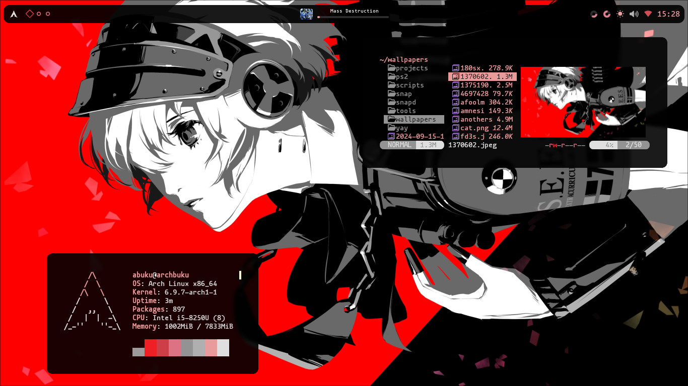
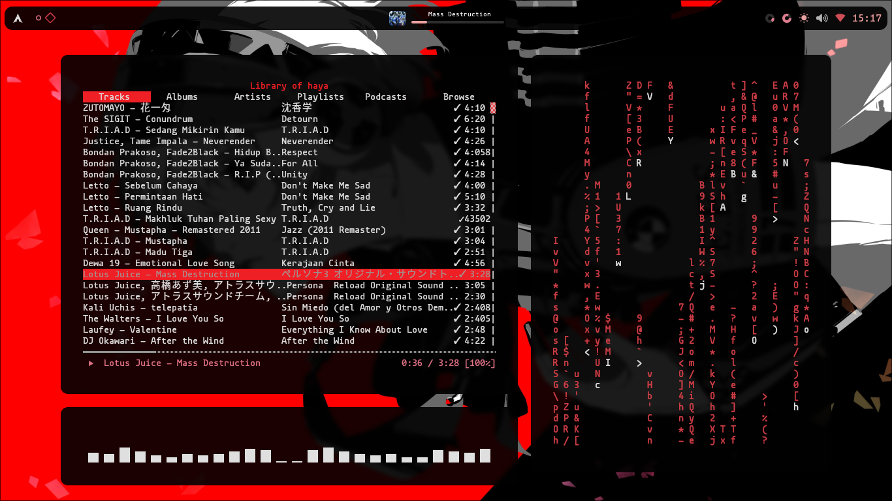

# Zenities Hyprland 💧


Thank you so much for visiting my Hyprland rice. I'm relatively new to ricing, and while it's no where near perfect, I've put a lot of care into it. This rice is inspired by so many awesome people's work, though I regret I can't list everyone by name

I hope you enjoy it, and feel free to use this rice!

## Prerequisite
You have to disable autogenerate on the `hyprland.conf`.

### Steps

1. Open your terminal.

2. Traverse to `~/.config/hypr/`:
    
    ```bash
    cd ~/.config/hypr/
    ```

3. Use your favorite text editor to edit the `hyprland.conf` file. For example, using `nano`:
    
    ```bash
    nano hyprland.conf
    ```

4. Look for the section or line that enables autogeneration. This may look like:

    ```
    autogen=1
    ```

5. Disable autogeneration by changing the value to `0` or commenting out the line:

    ```bash
    # autogen=1
    ```

6. Save the file and exit the editor. For `nano`, press `Ctrl+O`, then `Enter` to save, and `Ctrl+X` to exit.

7. Restart Hyprland for the changes to take effect:
    
    ```bash
    hyprctl reload
    ```

8. Verify that the settings are no longer being autogenerated by checking if your custom configurations persist after a restart.

## Installation

### ⚠️ Requirements ⚠️
This installation script **only works on Arch Linux** and requires **Hyprland** to be installed.

### Steps

1. Open your terminal and install Git:

    ```bash
    sudo pacman -S git
    ```

2. Clone this repository in your Home directory:

    ```bash
    cd $HOME
    git clone https://github.com/hayyaoe/zenities
    ```

3. Navigate to the project directory:

    ```bash
    cd zenities
    ```

4. Run the installation script:

    ```bash
    sh INSTALL.sh
    ```

### Note
After installing this rice, the system will automatically reboot. On the first load, the colors may appear incorrect because the cache from Pywal is not available yet. To fix this, you will need to reload the wallpaper 2-3 times by using the key combination `SUPER + SHIFT + W` to open the wallpaper picker then pick a wallpaper so pywal reloads.  
- On macOS, the `SUPER` key refers to the **Command** key.
- On most other keyboards, `SUPER` refers to the **Windows** key.

---

For more details or issues, please visit the repository’s [issues page](https://github.com/hayyaoe/zenities/issues).

## Details

- OS: **[Arch Linux](https://github.com/archlinux)**
- DE: **[Hyprland](https://github.com/hyprwm/Hyprland)**
- Terminal: **[Kitty](https://github.com/kovidgoyal/kitty)**
- Music Player: **[ncspot](https://github.com/hrkfdn/ncspot)**
- Shell: **[zsh](https://github.com/zsh-users/zsh)**
- Bar: **[eww](https://github.com/elkowar/eww)**
- App Launcher: **[Rofi](https://github.com/davatorium/rofi)**
- Editor: **[Neovim](https://github.com/neovim/neovim)**
- File Manager: **[yazi](https://github.com/sxyazi/yazi)**

This rice utilized pywal to create custom colorscemes depending on the wallpaper used.

## Screenshots





## Credits
- **[Rxyhn](https://github.com/rxyhn/tokyo)**
- **[saimoomedits](https://github.com/saimoomedits/eww-widgets/tree/main)**
