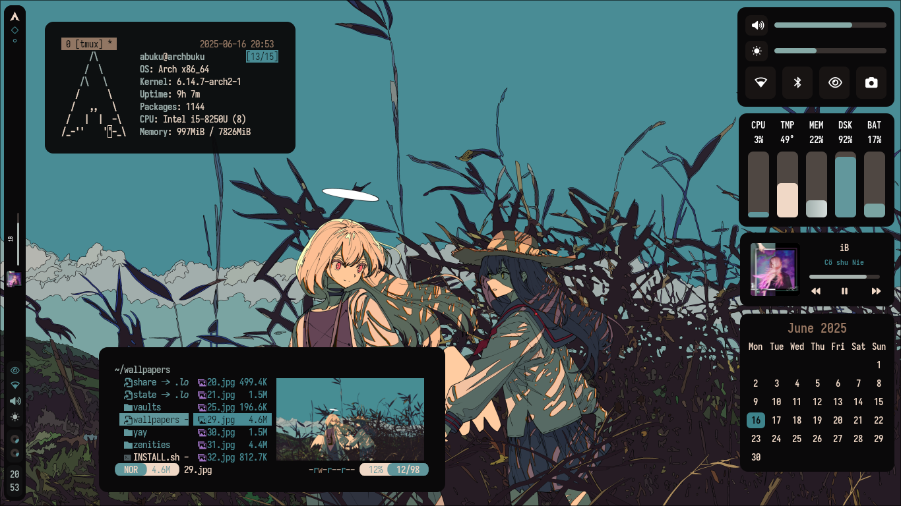
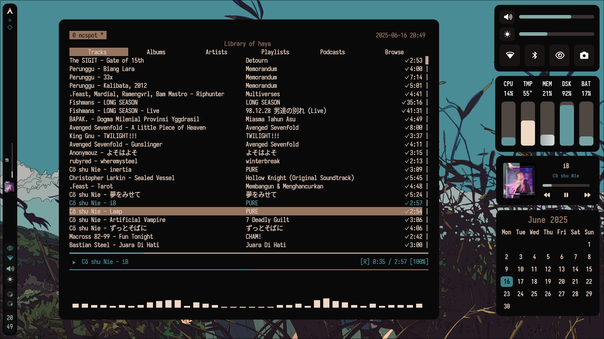
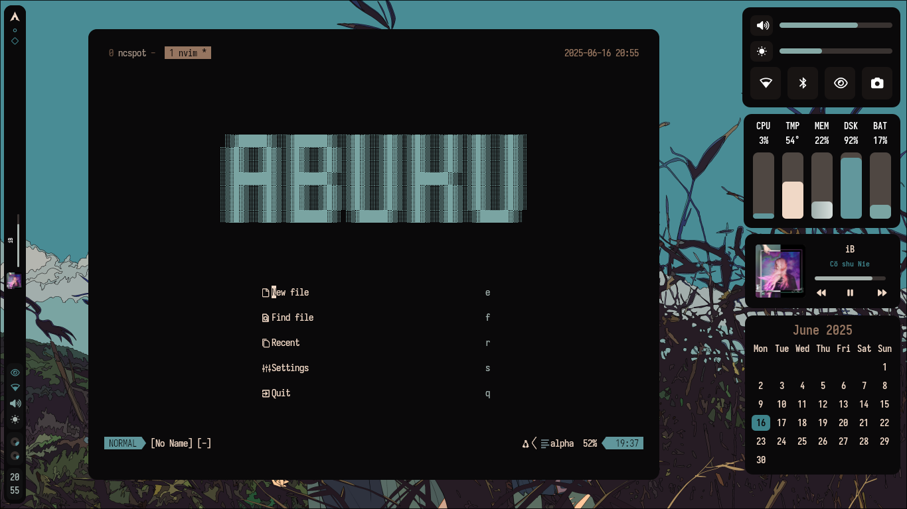

# Zenities Hyprland 💧



Thank you so much for visiting my Hyprland rice. I'm relatively new to ricing, and while it's no where near perfect, I've put a lot of care into it. This rice is inspired by so many awesome people's work, though I regret I can't list everyone by name

I hope you enjoy it, and feel free to use this rice!

## Prerequisite
You have to disable autogenerate on the `hyprland.conf`.

### Steps

1. Open your terminal.

2. Traverse to `~/.config/hypr/`:
    
    ```bash
    cd ~/.config/hypr/
    ```

3. Use your favorite text editor to edit the `hyprland.conf` file. For example, using `nano`:
    
    ```bash
    nano hyprland.conf
    ```

4. Look for the section or line that enables autogeneration. This may look like:

    ```
    autogenerated=1
    ```

5. Disable autogeneration by changing the value to `0` or commenting out the line:

    ```bash
    # autogenerated=1
    ```

6. Save the file and exit the editor. For `nano`, press `Ctrl+O`, then `Enter` to save, and `Ctrl+X` to exit.

7. Restart Hyprland for the changes to take effect:
    
    ```bash
    hyprctl reload
    ```

8. Verify that the settings are no longer being autogenerated by checking if your custom configurations persist after a restart.

## Installation

### ⚠️ Requirements ⚠️
This installation script **only works on Arch Linux** and requires **Hyprland** to be installed.

### Steps

1. Open your terminal and install Git:

    ```bash
    sudo pacman -S git
    ```

2. Clone this repository in your Home directory:

    ```bash
    cd $HOME
    git clone https://github.com/hayyaoe/zenities
    ```

3. Navigate to the project directory:

    ```bash
    cd zenities
    ```

4. Run the installation script:

    ```bash
    sh INSTALL.sh
    ```

---

For more details or issues, please visit the repository’s [issues page](https://github.com/hayyaoe/zenities/issues).

---

## Keybinds

### ⚡ Launch Applications

| Action                 | Keybind                    | Description                          |
|------------------------|----------------------------|--------------------------------------|
| Terminal (tiled)       | `SUPER + RETURN`           | Launch terminal with `tmux`          |
| Terminal (floating)    | `SUPER + SHIFT + RETURN`   | Launch floating terminal             |
| File Manager (Yazi)    | `SUPER + M`                | Launch Yazi via custom script        |
| Yazi (floating)        | `SUPER + SHIFT + M`        | Launch Yazi in floating window       |
| Browser                | `SUPER + B`                | Launch your default browser          |
| App Launcher / Menu    | `SUPER + SPACE`            | Launch application menu (`$menu`)    |

---

### 🧰 System Scripts

| Action                  | Keybind                  | Description                            |
|-------------------------|--------------------------|----------------------------------------|
| Reload Wallpaper        | `SUPER + A`              | Reload Hyprpaper config                |
| Power Menu              | `SUPER + P`              | Launch power management script         |
| Select Wallpaper        | `SUPER + SHIFT + W`      | Run wallpaper selector script          |
| Launch Widgets          | `SUPER + H`              | Run Eww or custom widget script        |
| Reload Waybar           | `SUPER + R`              | Run Eww reload waybar script           |

---

### 🪟 Window Actions

| Action            | Keybind           | Description                           |
|-------------------|-------------------|---------------------------------------|
| Kill Window       | `SUPER + Q`       | Close the currently focused window    |
| Toggle Floating   | `SUPER + V`       | Toggle floating mode for active window|
| Toggle Split      | `SUPER + J`       | Toggle split orientation (vertical/horizontal) |
| Fullscreen        | `SUPER + F`       | Toggle fullscreen mode                |

---

### 📌 Window Focus
Use `ALT + [key]` to change focus between tiled windows:

| Direction | Keybind     |
|-----------|-------------|
| Left      | `ALT + h`   |
| Right     | `ALT + l`   |
| Up        | `ALT + k`   |
| Down      | `ALT + j`   |

---

### 🪟 Move Tiled Window
Use `ALT + SHIFT + [key]` to move a focused window in the specified direction:

| Direction | Keybind         |
|-----------|-----------------|
| Left      | `ALT + SHIFT + h` |
| Right     | `ALT + SHIFT + l` |
| Up        | `ALT + SHIFT + k` |
| Down      | `ALT + SHIFT + j` |

---

### 📏 Resize Tiled Window
Use `SUPER + ALT + [key]` to resize the focused window:

| Direction | Keybind              | Action       |
|-----------|----------------------|--------------|
| Shrink ←  | `SUPER + ALT + h`    | Resize left  |
| Expand →  | `SUPER + ALT + l`    | Resize right |
| Shrink ↑  | `SUPER + ALT + k`    | Resize up    |
| Expand ↓  | `SUPER + ALT + j`    | Resize down  |

---

### 🧲 Move Floating Window
Use `SUPER + CTRL + [key]` to move floating windows:

| Direction | Keybind              |
|-----------|----------------------|
| Left      | `SUPER + CTRL + h`   |
| Right     | `SUPER + CTRL + l`   |
| Up        | `SUPER + CTRL + k`   |
| Down      | `SUPER + CTRL + j`   |

---

## Notes
- Most of the keybinds here are designed with colemak as the default layout so feel free to customize.
- `SUPER` typically refers to the Windows key or Command key, depending on your keyboard.
- These keybindings follow a HJKL (Left-Down-Up-Right) layout, inspired by VIM-style ergonomics for faster directional control.
- You can customize these further to suit your workflow or preferred keyboard layout.

---

## Details

- OS: **[Arch Linux](https://github.com/archlinux)**
- DE: **[Hyprland](https://github.com/hyprwm/Hyprland)**
- Terminal: **[Kitty](https://github.com/kovidgoyal/kitty)**
- Music Player: **[ncspot](https://github.com/hrkfdn/ncspot)**
- Shell: **[zsh](https://github.com/zsh-users/zsh)**
- Bar: **[eww](https://github.com/elkowar/eww)**
- App Launcher: **[Rofi](https://github.com/davatorium/rofi)**
- Editor: **[Neovim](https://github.com/neovim/neovim)**
- File Manager: **[yazi](https://github.com/sxyazi/yazi)**

This rice utilized pywal to create custom colorscemes depending on the wallpaper used.

## Screenshots




## Credits
- **[Rxyhn](https://github.com/rxyhn/tokyo)**
- **[saimoomedits](https://github.com/saimoomedits/eww-widgets/tree/main)**
- **[Vimjoyer](https://www.youtube.com/@vimjoyer)**

## Star History

[](https://www.star-history.com/#hayyaoe/zenities&Date)
